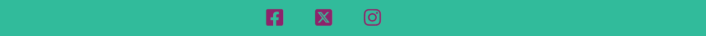

<h1 align="center">SomScience</h1>

![SomScience on a variety of screen sizes(https:"load image from asets once deployed website")]

View the live website: [SomScience](https:"")

This is the website for a science museum based in Somerset - SomScience. An interactive, fun museum to inspire and engage everyone who might visit, but with a focus on the captivating children. The site intends to showcase the  main features of the museum in an visually appealing way to inspire a visit, and give key information that a visitor might require.

ADD INFO RE LAST COMMIT, CONTRIBUTORS, LANGUAGE, TOP LANGUAGE AND VALIDATION?

## Contents

* [User Experience](user-experience-(ux))
* [The Museum's Features](the-museum's-features)
* etc, update at end once have different sections.

---

## STRATERGY FOR THE WEBSITE

## User Experience (UX)

Using UX design principles, I contemplated the key features a science museum could have and the corresponding information a website would need to contain.

### The Museum's Features

* Discovery Zones: Interactive, accessible exhibits to engage the public (all ages) in 4 key areas of interest (The Human Body, Plants and the Environment, Space, Materials and Movement). Including a workshop for scientific crafting.
  
* Live Scientific Demonstrations: Seasonal displays of science in action with multiple showings/day.
  
* Lab experiences: An opportunity for visitors to participate in age-appropriate lab experiments and answer the “Question of the Day”.

* Core Facilities: toilets, café, shop, lockers, picnic area

### User Stories

* #### Client (Museum) Goals
  
    1. To promote the museum and inspire people to visit with viusually engaging, "fun" content that highlights the child target audience.

    2. To have clear, concice information that is easy to navigate and is accessible on multiple screen sizes and to those using screen readers

    3. To allow users to submit a question prior to visiting with acknowledgment (positive user experience) that the question has been submitted.

* #### First Time User Goals

    1. To understand the purpose of the site and understand what attractions the museum offers.

    2. To be able to navigate the page without any difficulties.

    3. To be able to easily find the key information about the museum.

* #### Frequent/Return User Goals

    1. To be able to jump to a particular section of the website quickly, without having to scroll

    2. To be able to ask a question via a contact form.

    3. To be able to follow the museum on a chosen social media platform.

---

## SCOPE

### Opportunities Martix

The ideas summarising what the museum would contain were summarized in an opportunity matrix to identify the most important features of the website (phase 1 deployment) and identify what could be rolled out in the future (phase 2 deployment)

#### Table 1 Opportunity summary

|Opportunity                            |Importance|Viability|Score|
|:-------------------------------------:|:--------:|:-------:|:---:|
| Showcase the museums main features    | 5        | 5       | 10  |
| Shop                                  | 2        | 0       | 2   |
| Discovery zone info                   | 5        | 4       | 9   |
| Key information for visiting          | 5        | 5       | 10  |
| Contact/question form                 | 4        | 4       | 8   |
| Lab experience details/booking        | 2        | 4       | 6   |
| Increase social media presence        | 4        | 4       | 8   |
| Membership options                    | 1        | 3       | 4   |
| Bookings page                         | 1        | 0       | 1   |
| The workshop                          | 3        | 3       | 6   |

Based on the score, the opportunities were sumarised into their roll out phase.

#### Table 2 Roll out

|Opportunity                             | Phase for Roll Out|
|:-------------------------------------:|:-----------------:|
| Showcase the museums main features    | 1                 |
| Key information for visiting          | 1                 |
| Discovery Zone Info                   | 1                 |
| Increase social media presence        | 1                 |
| Contact/question form                 | 1                 |
| Shop                                  | 2                 |
| Lab experience Info                   | 2                 |
| Membership options                    | 2                 |
| Bookings page                         | 2                 |
| The workshop                          | 2                 |

---

## STRUCTURE - phase 1 roll out

The website will consist of an introductory page showcasing the main features of the museum with corresponding (linked pages) to different areas. A total of 4 pages. This will provide users with an overview of all the features of the museum, giving multiple opportunities to inspire a visit with visually captivating images.

### Pages

  1. Home (index) page
     * Hero image to captivate the viewer. Title- SomScience, Somerset's Interactive Science Museum.
     * Summary of what's inside the museum/leading info to get users to explore further. Linked pages.
  2. Inside
     * Sections that explain key features of the muesum with images
     * ordered according to their ability to intice and inspire user
     * sub nav menu within this section to users can see what the page (and museum) has to offer quickly, without having to scroll all the way through.
  3. Visit
     * Sections informing users about admission prices, other facilities and how to find us (map).
     * Link to contact page.
  4. Contact
     * Form to input question
     * Additional contact info (tel, email)
  5. Every Page
     * Sticky navigation bar that toggles on small screens inc logo which takes back to home screen
     * Footer containing the museum's social media links (as this site is fictional, these will link to the home pages)
  
  ---

## SKELETON

### Wireframes

Wireframes outline how the content will be veiwed on different devices. They were created using balsamic.

1. Home page

2. Inside page

3. Visit page

4. Contact page

Each page will be responsive and the user will be able to navigate between pages in multiple ways. Clicking the:

* Logo and home nav bar naviagtes to home page (index)
* Key word titles on home page will navigate to the relavent section on the "inside" page,
* The inside page will have navigation to each inside section + a "back to top"
* The visit page will have a "want to speak to us" question with a button that links to the contact page.

---

## SURFACE DESIGN

### Logo

 A bright lightbulb image was found on vecteezy for the logo. The lightbulb inspiring an "idea" and has associations with thinking and science.

 

### Colour Scheme

 Using ColorZilla I chose the key colours from the logo to use throughout the website. The emphasis being on bright, fun, fresh, engaging.

 I arranged them to see how they would look together using Colour pallet.

 

* I have used `#31BB9B` as the primary colour throughout the site. It is subtle and stands out against multiple picture colours. Also it is very gender neutral.
* I have used `#8D236B` as my secondary colour as it best complements my priamry colour and works with subsequnt colours on the page.
* I have used muted versions of `#CD2026`, `#4075A1` and `#FFCC33` to highlight different areas of a page.

### Typography

Google fonts was used to import fonts for this site. I have used a combination of roboto and cookie to give a visual balance on the page and convey that this museum is factual but remains fun.

* Roboto is a clean, simple, educated font which stands out and is clearly readable even in smaller fonts.
  
  

* Cookie is a caligraphy style and gives the more creative, spoken, fun elements to the page.

  

### Imagery

  Images used throughout the site aim to inspire and inform the user what they could expect from the museum.

  The hero image, as it is the first thing a user sees, was chosen as it encompasses many of the values of the museum: investigation (magnefying glass), smiles (fun) and children.

  Other images were chosen to ensure they potrayed a variety of colours, interests and ethnicities.

### Features

Each of the website's pages will have a sticky, navigation tab that includes the museum's logo. This acts as a link back to the home page.
  
 

 The navigation bar will toggle on smaller devices.

 

 At the foot of each page are links to the museum's social media platforms (as this is a ficitional site, these are set to the home page)

  

#### The Home Page

 The home page captivates the user with a hero image which has a container displaying the museum's name (SomScience) with it's key slogan, "curiosity at it's best". Below this there are three images which summarise three key messages of the museum: discover, experience, interact. Each of these words navigate to the relavent section on the "inside" page.

 ADD IN IMAGE OF HOME SCREEN ON MULTIPLE DEVICES!!!!!!!!!!!!!!

#### The Inside Page

 The sections of the museum are: discover, lab experience, cafe & shop and quiet space, each defined using a muted version of the pages chosen colours and containg three images related to it's content. There is also a breif summary of what each area offers with key words highlighted in bold.

 Underneath the navigation pane will be an additional "navigation menu" which allows the user to move through the different areas of the page without scrolling all the way through.

 Additionally, there is a "back to the top" button at the end of each section.  

.

 ADD IN IMAGE OF HOME SCREEN ON MULTIPLE DEVICES!!!!!!!!!!!!!!

#### The Visit Page

This page aims to give an user the key information they would need to successfully visit: prices, openeing times, facility info and the addres with a link that takes them to the contact page, should they have any more questions.

 ADD IN IMAGE OF HOME SCREEN ON MULTIPLE DEVICES!!!!!!!!!!!!!!

 Together with the address, a map appears on the page to improve UX and prevent a user having to navigate away from the page to find out where the museum is located.

.

#### The Contact Page

 ADD IN IMAGE OF HOME SCREEN ON MULTIPLE DEVICES!!!!!!!!!!!!!!

The contact page gives the user the ability to submit a question to the museum. The form takes key details, first name, last name, email, with a subject box to direct the question to the right area of enquiry.

The image on this page links back the logo and represents the lightbulb "idea" and asking a question.

### Future roll outs

In the future i'd like to address features that correspond to [phase 2](#table-2-roll-out) of my roll out

1. Add separate pages for the cafe, shop and workshop which give more details for these areas.
2. Give users the oppertunity to book tickets and the lab experience online before visiting.
3. Give users the option to become members online.
4. Add a virtual tour of the museum's main exhibtion space on the "inside page"

### Accessibility

Whilst writting the code for this site i've ensured each page is accessible. I've therefore inluded the following features:

* Hover features so a user knows when they are positioned over a link word/button.
* Aria labelling to identify differnt parts of the page, link images with corresponding text and describe where buttons/links navigate to.
* A screen reader attribute that lets the user know which page they are on.
* Semantic HTML
* Contrasting colours to ensure content is readible (even over pictures)

To further check the assesibiltiy of my website, I used the [Web Disability Simulator](https://chromewebstore.google.com/detail/web-disability-simulator/olioanlbgbpmdlgjnnampnnlohigkjla?pli=1) on google chorme to check if my content was still readible with red/green and yellow/blue colour blindness.

.

---

## Technologies Used

### Languages

HTML, CSS and Javascript (via Bootsrap)

### Frameworks, Libraries and Programmes Used

* [Codeanywhere](https://app.codeanywhere.com/) - to create the site (IDE).
  
* [Balsamiq](https://balsamiq.com/) - to create wireframes.
  
* [Github](https://github.com/) - to save and store the files for the website.

* [Git](https://git-scm.com/) - for version control, using the Gittpod terminal to commit to Git and Push to GitHub.

* [Bootstrap version 5.3](https://getbootstrap.com/) - to onput different features of the website and assist responsive styling.

* [Font Awesome:](https://fontawesome.com/) - to add familiure icons and improve the UX.

* [Google Fonts](https://fonts.google.com/) - to browse and import the fonts used on the website.

* [ColorZilla](https://chromewebstore.google.com/detail/colorzilla/bhlhnicpbhignbdhedgjhgdocnmhomnp) - to pick colours from images and get colour codes.
  
* [Google Developer Tools](https://developer.chrome.com/docs/devtools/) - to veiw responsive styling and troubleshoot/solve issues.

* [Favicon.io](https://favicon.io/) - to create the SomScience favicon.

* [Birme](https://www.birme.net/) - to resize images and compress images.

* [TinyPNG](https://tinypng.com/) - to compress larger images.

* [Am I Responsive?](http://ami.responsivedesign.is/) - to show what the website looks like on different devices.

* [Web Disability Simulator](https://chromewebstore.google.com/detail/web-disability-simulator/olioanlbgbpmdlgjnnampnnlohigkjla) - to view the website under different accesibiity filters.

* [Webpage Spell-Check](https://chrome.google.com/webstore/detail/webpage-spell-check/mgdhaoimpabdhmacaclbbjddhngchjik/related) - to spell check the webpage and readme file.

---

## Testing

FINISH THIS SECTION

---

## Deployment & Local Development

### Deployment

The SomScience website is deployed using GitHub pages - (DEPLOYED SITE LINK)

1. Login (or signup) to Github.
2. Navigate to the project repository,.
3. WRITE FOLLOWING INSTRUCTIONS IN OWN HAND
4. Click the settings button.
5. Select pages in the left hand navigation menu.
6. From the source dropdown select main branch and press save.
7. The site has now been deployed, please note that this process may take a few minutes before the site goes live.

### Local Development
