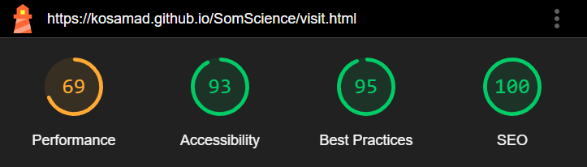

<h1 align="center">SomScience</h1>

View the live website: [SomScience](https://kosamad.github.io/SomScience/index.html)

This is the website for a science museum based in Somerset - SomScience. An interactive, fun museum to inspire and engage everyone who might visit, but with a focus on the captivating children. The site intends to showcase the  main features of the museum in an visually appealing way to inspire a visit, and give key information that a visitor might require.

ADD INFO RE LAST COMMIT, CONTRIBUTORS, LANGUAGE, TOP LANGUAGE AND VALIDATION?

## Contents

* [User Experience](user-experience-(ux))
* [The Museum's Features](the-museum's-features)
* etc, update at end once have different sections.

---

## STRATERGY FOR THE WEBSITE

## User Experience (UX)

Using UX design principles, I contemplated the key features a science museum could have and the corresponding information a website would need to contain.

### The Museum's Features

* Discovery Zones: Interactive, accessible exhibits to engage the public (all ages) in 4 key areas of interest (The Human Body, Plants and the Environment, Space, Materials and Movement). Including a workshop for scientific crafting.
  
* Live Scientific Demonstrations: Seasonal displays of science in action with multiple showings/day.
  
* Lab experiences: An opportunity for visitors to participate in age-appropriate lab experiments and answer the “Question of the Day”.

* Core Facilities: toilets, café, shop, lockers, picnic area

### User Stories

* #### Client (Museum) Goals
  
    1. To promote the museum and inspire people to visit with viusually engaging, "fun" content that highlights the child target audience.

    2. To have clear, concice information that is easy to navigate and is accessible on multiple screen sizes and to those using screen readers

    3. To allow users to submit a question prior to visiting with acknowledgment (positive user experience) that the question has been submitted.

* #### First Time User Goals

    1. To understand the purpose of the site and understand what attractions the museum offers.

    2. To be able to navigate the page without any difficulties.

    3. To be able to easily find the key information about the museum.

* #### Frequent/Return User Goals

    1. To be able to jump to a particular section of the website quickly, without having to scroll

    2. To be able to ask a question via a contact form.

    3. To be able to follow the museum on a chosen social media platform.

---

## SCOPE

### Opportunities Martix

The ideas summarising what the museum would contain were summarized in an opportunity matrix to identify the most important features of the website (phase 1 deployment) and identify what could be rolled out in the future (phase 2 deployment)

#### Table 1 Opportunity summary

|Opportunity                            |Importance|Viability|Score|
|:-------------------------------------:|:--------:|:-------:|:---:|
| Showcase the museums main features    | 5        | 5       | 10  |
| Shop                                  | 2        | 0       | 2   |
| Discovery zone info                   | 5        | 4       | 9   |
| Key information for visiting          | 5        | 5       | 10  |
| Contact/question form                 | 4        | 4       | 8   |
| Lab experience details/booking        | 2        | 4       | 6   |
| Increase social media presence        | 4        | 4       | 8   |
| Membership options                    | 1        | 3       | 4   |
| Bookings page                         | 1        | 0       | 1   |
| The workshop                          | 3        | 3       | 6   |

Based on the score, the opportunities were sumarised into their roll out phase.

#### Table 2 Roll out

|Opportunity                             | Phase for Roll Out|
|:-------------------------------------:|:-----------------:|
| Showcase the museums main features    | 1                 |
| Key information for visiting          | 1                 |
| Discovery Zone Info                   | 1                 |
| Increase social media presence        | 1                 |
| Contact/question form                 | 1                 |
| Shop                                  | 2                 |
| Lab experience Info                   | 2                 |
| Membership options                    | 2                 |
| Bookings page                         | 2                 |
| The workshop                          | 2                 |

---

## STRUCTURE - phase 1 roll out

The website will consist of an introductory page showcasing the main features of the museum with corresponding (linked pages) to different areas. A total of 4 pages. This will provide users with an overview of all the features of the museum, giving multiple opportunities to inspire a visit with visually captivating images.

### Pages

  1. Home (index) page
     * Hero image to captivate the viewer. Title- SomScience, Somerset's Interactive Science Museum.
     * Summary of what's inside the museum/leading info to get users to explore further. Linked pages.
  2. Inside
     * Sections that explain key features of the muesum with images
     * ordered according to their ability to intice and inspire user
     * sub nav menu within this section to users can see what the page (and museum) has to offer quickly, without having to scroll all the way through.
  3. Visit
     * Sections informing users about admission prices, other facilities and how to find us (map).
     * Link to contact page.
  4. Contact
     * Form to input question
     * Additional contact info (tel, email)
  5. Every Page
     * Sticky navigation bar that toggles on small screens inc logo which takes back to home screen
     * Footer containing the museum's social media links (as this site is fictional, these will link to the home pages)
  
  ---

## SKELETON

### Wireframes

Wireframes outline how the content will be veiwed on different devices. They were created using balsamic.

1. Home page

2. Inside page

3. Visit page

4. Contact page

Each page will be responsive and the user will be able to navigate between pages in multiple ways. Clicking the:

* Logo and home nav bar naviagtes to home page (index)
* Key word titles on home page will navigate to the relavent section on the "inside" page,
* The inside page will have navigation to each inside section + a "back to top"
* The visit page will have a "want to speak to us" question with a button that links to the contact page.

---

## SURFACE DESIGN

### Logo

 A bright lightbulb image was found on vecteezy for the logo. The lightbulb inspiring an "idea" and has associations with thinking and science.

 

### Colour Scheme

 Using ColorZilla I chose the key colours from the logo to use throughout the website. The emphasis being on bright, fun, fresh, engaging.

 I arranged them to see how they would look together using the [Coolers](https://coolors.co/) Colour pallet.

 

* I have used `#31BB9B` as the primary colour throughout the site. It is subtle and stands out against multiple picture colours. Also it is very gender neutral.
* I have used `#8D236B` as my secondary colour as it best complements my priamry colour and works with subsequnt colours on the page.
* I have used muted versions of `#CD2026`, `#4075A1` and `#FFCC33` to highlight different areas of a page.

### Typography

Google fonts was used to import fonts for this site. I have used a combination of roboto and cookie to give a visual balance on the page and convey that this museum is factual but remains fun.

* Roboto is a clean, simple, educated font which stands out and is clearly readable even in smaller fonts.
  
  

* Cookie is a caligraphy style and gives the more creative, spoken, fun elements to the page.

  

### Imagery

  Images used throughout the site aim to inspire and inform the user what they could expect from the museum.

  The hero image, as it is the first thing a user sees, was chosen as it encompasses many of the values of the museum: investigation (magnefying glass), smiles (fun) and children.

  Other images were chosen to ensure they potrayed a variety of colours, interests and ethnicities.

### Features

Each of the website's pages will have a sticky, navigation tab that includes the museum's logo. This acts as a link back to the home page. The colour of each navigation item changes colour when it is selected/hovered over from green to black.
  
 

 The navigation bar will toggle on smaller devices.

 

 At the foot of each page are links to the museum's social media platforms (as this is a ficitional site, these are set to the home page)

  

#### The Home Page

 The home page captivates the user with a hero image which has a container displaying the museum's name (SomScience) with it's key slogan, "curiosity at it's best". Below this there are three images which summarise three key messages of the museum: discover, experience, interact. Each of these words navigate to the relavent section on the "inside" page.

#### The Inside Page

 

 The sections of the museum are: discover, lab experience, cafe & shop and quiet space, each defined using a muted version of the pages chosen colours and containg three images related to it's content. There is also a breif summary of what each area offers with key words highlighted in bold.

 Underneath the navigation pane will be an additional "navigation menu" which allows the user to move through the different areas of the page without scrolling all the way through.

 Additionally, there is a "back to the top" button at the end of each section.  

.

#### The Visit Page

 

This page aims to give an user the key information they would need to successfully visit: prices, openeing times, facility info and the addres with a link that takes them to the contact page, should they have any more questions.

Together with the address, a map appears on the page to improve UX and prevent a user having to navigate away from the page to find out where the museum is located.

.

#### The Contact Page

The contact page gives the user the ability to submit a question to the museum. The form takes key details, first name, last name, email, with a subject box to direct the question to the right area of enquiry.

The image on this page links back the logo and represents the lightbulb "idea" and asking a question.

### Future roll outs

In the future i'd like to address features that correspond to [phase 2](#table-2-roll-out) of my roll out

1. Add separate pages for the cafe, shop and workshop which give more details for these areas.
2. Give users the oppertunity to book tickets and the lab experience online before visiting.
3. Give users the option to become members online.
4. Add a virtual tour of the museum's main exhibtion space on the "inside page"
5. Improve the performance of the page (see [Testing](#testing) section below)

### Accessibility

Whilst writting the code for this site i've ensured each page is accessible. I've therefore inluded the following features:

* Hover features so a user knows when they are positioned over a link word/button.
* Aria labelling to identify differnt parts of the page, link images with corresponding text and describe where buttons/links navigate to.
* A screen reader attribute that lets the user know which page they are on.
* Semantic HTML
* Contrasting colours to ensure content is readible (even over pictures)

To further check the assesibiltiy of my website, I used the [Web Disability Simulator](https://chromewebstore.google.com/detail/web-disability-simulator/olioanlbgbpmdlgjnnampnnlohigkjla?pli=1) on google chorme to check if my content was still readible with red/green and yellow/blue colour blindness.

.

---

## Technologies Used

### Languages

HTML, CSS and Javascript (via Bootsrap)

### Frameworks, Libraries, Programmes and Tools Used

* [Codeanywhere](https://app.codeanywhere.com/) - to create the site (IDE).
  
* [Balsamiq](https://balsamiq.com/) - to create wireframes.
  
* [Github](https://github.com/) - to save and store the files for the website.

* [Git](https://git-scm.com/) - for version control, using the Gittpod terminal to commit to Git and Push to GitHub.

* [Bootstrap version 5.3](https://getbootstrap.com/) - to input different features of the website and assist responsive styling using the drid system.

* [Font Awesome:](https://fontawesome.com/) - to add familiure icons and improve the UX.

* [Google Fonts](https://fonts.google.com/) - to browse and import the fonts used on the website.

* [ColorZilla](https://chromewebstore.google.com/detail/colorzilla/bhlhnicpbhignbdhedgjhgdocnmhomnp) - to pick colours from images and get colour codes.
  
* [Google Developer Tools](https://developer.chrome.com/docs/devtools/) - to veiw responsive styling and troubleshoot/solve issues.

* [Favicon.io](https://favicon.io/) - to create the SomScience favicon.

* [Birme](https://www.birme.net/) - to resize images and compress images.

* [TinyPNG](https://tinypng.com/) - to compress larger images.

* [Coolers](https://coolors.co/) Colour pallet - to view the colour scheme.

* [Am I Responsive?](http://ami.responsivedesign.is/) - to show what the website looks like on different devices.

* [Web Disability Simulator](https://chromewebstore.google.com/detail/web-disability-simulator/olioanlbgbpmdlgjnnampnnlohigkjla) - to view the website under different accesibiity filters.

* [Webpage Spell-Check](https://chrome.google.com/webstore/detail/webpage-spell-check/mgdhaoimpabdhmacaclbbjddhngchjik/related) - to spell check the webpage and readme file.

* [GitHub Wiki Toc generator](https://ecotrust-canada.github.io/markdown-toc/) - to automatically create my contents page in the README.md file.

* [Form Submit](https://formsubmit.co/) - to automatically move to a thank you page after the form submit.

---

## Testing

### User Stories from the [UX design](#user-stories)

* #### Client Goals

    1. To promote the museum and inspire people to visit with visually engaging, "fun" content that highlights the child target audience.

       * The site is filled with fun, bright images that promote the museum's content and highlight visitors interacting with their hands.

       * Children feature heavily in the images to highlight that the museum is primarily aimed at children.

    2. To have clear, concise information that is easy to navigate and is accessible on multiple screen sizes and to those using screen readers.

       * The website holds only key information to make it easy for a visitor to find what they are looking for.

       * Navigation bars allow a user to move between sections easily (see details below).

       * The site is fully responsive and contains aria attributes to cater to different screen sizes and those using screen readers.

    3. To allow users to submit a question prior to visiting with acknowledgment (positive user experience) that the question has been submitted.

       * A user can contact the museum using the information on the contact page. This includes a form, with a subject drop down to feed the question to the right team, and a direct email/tel number for more immediate enquiries.  

       * The contact page is also accessible from the visit page through a call-to-action button, as many people look for this information next to a map.  

* #### Testing First Time User Goals

    1. To understand the purpose of the site and understand what attractions the museum offers.

        * On the Home Page the user is met with a hero image portraying curiosity and children, immediately showcasing what this website is for.  

        * A variety of images are shown to allow the user to see the multitude of exhibits and attractions at the museum

        * The Inside Page allows the user to navigate between clearly defined sections which summarise the museum’s main features.  

    2. To be able to navigate the page without any difficulties.

        * The navigation bar at the top of the page is cleanly designed and allows a user to move to the page of interest easily, with clearly named links.  

        * The navigation bar is also sticky, so a user can navigate to a new page whenever they like, without having to scroll all the way back to the top and they do not feel stuck on any one page.  

        * The Inside Page has a separate navigation bar and “back to top” buttons placed at the end of each section to aid easy navigation.  

        * On smaller screens the main navigation bar toggles to give a better user experience.  

    3. To be able to easily find the key information about the museum.

        * The museum’s information is clearly laid out in well-defined sections to aid easy reading.  

        * This information is easily found through the navigation bar.

        * There are two ways to get to the contact form (see above in client goals). This gives the user the impression the museum is helpful, and keen to hear from them I.e. they are a valued customer.  

* #### Testing Frequent/Return User Goals

    1. To be able to jump to a particular section of the website quickly, without having to scroll

        * Once familiar with the site, the information in the navigation bars allows a user to quickly find the section they are looking for.

    2. To be able to ask a question via a contact form.

        * The form is well spaced with easy-to-read input boxes, allowing user to ask their question ahead of time

    3. To be able to follow the museum on a chosen social media platform.

        * Social media links are at the bottom of the page, which is where they are expected to be as this is their position on most websites.  

        * They are styled to fit in with the museum’s colour scheme and respond when the mouse hovers over them to improve UX

---

## Code Testing

Whilst building the site, I used Chrome developer tools to continuously test my page for responsiveness to different screen sizes and to troubleshoot any problems as they arose, using a step-by-step approach to find and fix issues.

I also used the layout part of Chrome developer to assist with the positioning of different elements on the page by experimenting with different margins and padding options.

### Manual Testing

The website was viewed on Chrome, Internet Explorer, Microsoft Edge, Firefox and to check the view was consistent between browsers.  

The website was also viewed on a desktop, mobile (pixel5 and iphone8) and a Levona tablet.

The website was reviewed by friends and family to ensure no bugs were present and to comment on the user experience. In each testing environment, users were asked to pay particular attention to the links and the overall look of the items on the page. They fed back that it would be more user friendly to link the “inside” page to the home page more (as all the link words went to the top of the inside page). I.e. link the lab experience section with the lab part on the inside page and highlight the café and quiet space. I therefore rearranged the images/names and links to fulfil this user experience.  

They fed back that all links worked and was responsive on different devices.

| Feature | Expected Outcome | Testing Performed | Result | Pass/Fail |
| :---: | :---: | :---: | :---: | :---: |
| Logo and title (on each page) | Navigate to the home page | Clicked title and logo separately | Home page reloads | Pass |
| Navigation menu (on each page) | Navigate to the correct page | Clicked on each link | Individual page loads | Pass |
| Images and Titles on Home screen | Navigate to the correct sections on Inside page | Clicked on each heading and image | Inside page loads | Pass |
| Button on Home page | Navigate to the Inside page | Clicked on button | Inside page loads | Pass |
| Sub-navigation menu on Inside page |  Navigate to the correct part of the page | Clicked on each heading | Jumps to the correct part of the page | Pass |
| Back to top button | Navigates to the top of the Inside page | Clicked on button under each section | Jumps back to the top of the page | Pass |
| Contact button on Visit page | Navigates to the contact page | Clicked on button | Navigates to Contact page | Pass |
| Submit button on Contact page| Automatically re-directs to the Thanks page | Submitted a form| Navigates to Thanks page | Pass |

### Automated Testing

#### W3C Validator

[W3C](https://validator.w3.org/) was used to test the HTML on the website and validate the CSS.

Please note that the error messages which relate to a "Trailing slash on void elements" have been filtered as they are automatically added by the browser and are not a true error.

* [index.html](documentation/screen_shots/validation/index.html-W3C.PNG) - passed
* [inside.html](documentation/screen_shots/validation/inside.html-W3C.PNG) - passed
* [visit.html](documentation/screen_shots/validation/visit.html-W3C.PNG) - passed
* [contact.html](documentation/screen_shots/validation/contact.html-W3C.PNG) - passed
* [thfffffff]
* [css](documentation/screen_shots/validation/css-W3C.PNG) - passed

#### Lighthouse

I used Lighthouse (a Chrome Developer tool) to test the performance, quality and correctness of the SomScience site.

The site performs well across all areas apart from performance. A number of elements could be addressed in a future roll out to improve the load speed of the page. This includes eliminating blocking elements caused from external styling and image adjustments.

* 
  
* 
  
* 
  
* 

---

## Solved Bugs

 **1. Lost footer on visit page**

* Navigating to the visit page, I lost the styling for the footer ([Image: footer missing](documentation/bugs/footer-missing.PNG), point 1).

* Attempt 1: tried copying and pasting code again from other pages again to check hadn’t accidentally deleted something.  

* I then checked the other pages which revealed further formatting issues (image 1, point 2) and also the footer was also missing on the index page.  

* Attempt 2: Scrutinized the CSS code and found a { missing from a media query.

 **2. Pages show "I" when hovering over links**

* On page a I shows instead of a mouse over links.  

* Attempt 1: Added a “cursor : pointer” to hover class.

* Attempt 2: Added a new “.cursor”, hover class to specific elements that I want to show the pointer on. This solved my issue on the logo image but not for any words. Developer tools showed that a elemnt.style (cursor-text) is automatically being applied.  

* Attempt 3: Added a “!important“ after a hover class overrides the BootStrap styling.

 **3. Bootstrap Nav Bar Toggler not working**

* **Issue 1:**- Toggle button not pressing at all.

* Attempt 1: After re-reading the Bootstrap documentation I realised I needed to put the "script" part of the Bootstrap code into the bottom of my page as this contains the "popper" which controls the nav bar toggler.

* **Issue 2:**- Menu overlays the rest of the page ([Image: menu overlay](documentation/bugs/menu-overlay.PNG)).
  
* Using both the core [Bootstrap code](https://getbootstrap.com/docs/5.3/components/navbar/#how-it-works) and the [Caterpilla_Montessori_MS_1](https://github.com/constantinadrian/Caterpillar_Montessori_MS_1) project for comparison,, I went through the code step by step to highlight any differences in the code.  

* Attempt 1: Required the additional "ml-auto" class for the "ul" and then modifications to the class (navbar-right) to put the styling in the correct place (added it to the div above). I also had to put an automatic margin on the navbar-nav class to push the content to the left.

**4. Margin at the top of the Inside page**

* When using the "back to top" link there was a margin at the top of the page which is poor UX ([Image: margin](documentation/bugs/margin.PNG)).

* Attempt 1: Added an additional "div" with a class "row" and then the id linking the content back to the top.  

---

## Deployment & Local Development

### Deployment

The [SomScience website](<https://kosamad.github.io/SomScience/>) is deployed using GitHub pages using the following steps:

1. Login (or signup) to Github.
2. Navigate to the project repository, [Somscience](https://github.com/kosamad/SomScience).
4. Click the settings button at the top of the page.
5. Select pages in the left hand navigation menu.
6. Under Build and Deployment, click the "Branch "dropdown menu and change it from "None", to "Main". Save.
7. The site has now been deployed to Github pages.
8. To find the site, click on "Deployments", on the right hand side of the repository.
9. Under the Deployments menu on the left, select "All Environments"
10. The deployed page can now be selected from the right, under github-pages.

### Forking the Github Repository

To copy the original repository and make changes without effecting the deployed site, the repository can be forked. To do this:

1. Log in to Github.
2. Navigate to the project repository, [Somscience](https://github.com/kosamad/SomScience).
3. Click on the "Fork" button at the top right of the page.

### Cloning the Github Repository

1. Log in to Github.
2. Navigate to the project repository, [Somscience](https://github.com/kosamad/SomScience).
3. Click on the code button and under the "Local" tab and select how you would like to clone (HTTPS, SSH or GitHub CLI.
4. Copy the link and use it to create a new workspace in your chosen IDE (code editor).

---

## Credit

### Code

* I found the websites for resizing/converting images, logo creation, spelling error identification, responsive sizing and the disability checker from “The Quiz Arms” GitHub ReadMe file.

* To learn how to embed a map into my website I watched this [YouTube video](https://www.youtube.com/watch?v=3posLKQrhfU).

* To understand how to add a Thank you page I watched this [YouTube video](https://www.youtube.com/watch?v=r4RQ38EoLds) and set up a form using the code from [Form Submit](https://formsubmit.co/) using a fictional email address (somscience.fictional.site@gmail.com).
  
* The Social Media icons - taken and modified from Matt Rudge bootstrap mini project "Resume Project" Code Institute.

* Bootstrap - for navbar, grid systems, forms and other classes that I used to make the page responsive.  

* To solve the nav-bar toggler bug I used the [Caterpilla_Montessori_MS_1](https://github.com/constantinadrian/Caterpillar_Montessori_MS_1) project to compare my HTML/CSS code with a working site.

* Favicon - for the code to import icons into this project

### Content

All content for this website was written by myself. However, I took inspiration from the science museums [We the Curious](https://www.wethecurious.org/) and [Techniquest](https://www.techniquest.org/discover/whats-on/).

### Media

* All images are sourced from Pexels, with specific credit to:

    Andrea Piacquadio, Billow, Charlotte May, Cottonbro Studio, Jessica Lewis, Kindal media, Lisa Fotios, Mart production, Marta Wave, Valeria Boltneva, Yan Krukau, Arthur Krijgsman, Mikhail Nilov, Rebecca Diack, Thirdman, Vlad Bagacian, and ketut-subiyanto.

* My Logo image is sourced from Vecteezy.

### Acknowledgments

* Code Institute for all course material

* Slack community and the Code Institue tutors for their add when I was stuck with the navigation toggler.

* My mentor Jubril for the support, feedback and encouragement that he gave me during this milestone project.  
